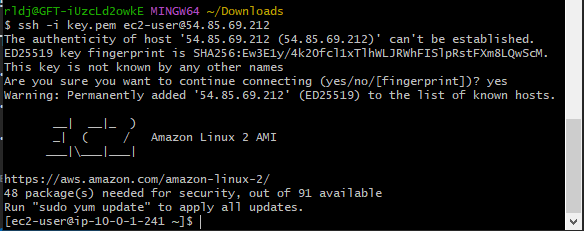

## 1 - Setup de ambiente
1) Ok.

## 2 - Networking
1) Mudei as inbound rules do security group atachado na instância

## 3 - EC2 Access
1) Criei um novo key pair, "key.pem"
2) Dei stop na instância EC2
3) Criei uma imagem dela
4) Na aba AMI, selecionei a imagem e dei launch com as mesmas configs da instância anterior.
5) Selecionei a chave criada, "key.pem", para atachar à essa instância. Foto do acesso:


### 1 - acesse a EC2:



###  2 - Altere o texto da página web exibida, colocando seu nome no início do texto do arquivo ***"/var/www/html/index.html"***.

1) (foto do resultado da troca abaixo, após corrigir a EC2)

## 4 - EC2 troubleshooting
1) quando a máquina foi startada pela criação da instância pela tarefa anterior, o service httpd não foi iniciado junto. Tive que reiniciar manualmente com o comando "systemctl restart httpd"

2) Para fazer o service iniciar no boot, realizei os comandos:

```
sudo systemctl enable httpd
```

Foto do curl com o título da página alterado após isso:


## 5 - Balanceamento
1) Criei uma cópia da instância acima a partir da imagem de seu volume

2) Criei um ELB

3) Criei um target group, atachando-o ao ELB. Atachei as 2 instâncias no target group.

4) A partir disso o ELB quando dei stop em uma das instâncias já apenas redireciona para a instância em "running"
 
## 6 - Segurança
1) Criei um security group pro loab balancer ("elbgroup")

2) Nas inbound rules do security group das instâncias, eu permiti tráfego apenas para o security group do balanceador (além do SSH)

3) Após isso, chamadas diretas às duas instâncias dão connection refused e as chamadas ao DNS do ELB funcionam normalmente.

