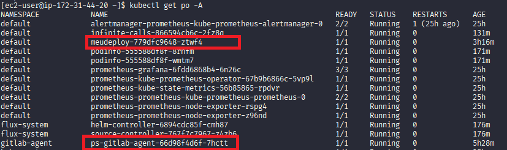
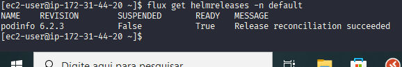
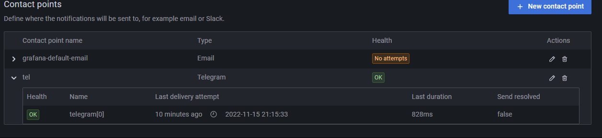
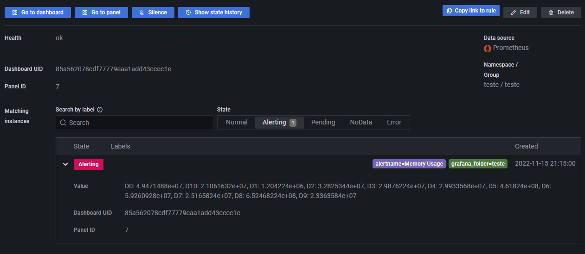

# 1. Gitlab
## Link repo: https://gitlab.com/raquelvaladao/desafio-repo
```txt
 -> 1.1 pipeline com build da imagem do app
     -> 1.2 [plus] linter do Dockerfile (tip: use o https://github.com/hadolint/hadolint)
        -> falhar se houver severidade >= Warning
  -> 1.3 [plus] scan da imagem usando Trivy (https://github.com/aquasecurity/trivy) standalone (binário)
     -> falhar se houver bug crítico
```
Tips:

- 1.4 - Instale o GitLab CI/CD workflow agent para fazer o build e aplicar os manifestos no cluster (caso não use fluxcd): https://docs.gitlab.com/ee/user/clusters/agent/install/
- Para fazer o build da imagem, utilize como base o pipeline em https://gitlab.com/gitlab-org/gitlab-foss/-/blob/master/lib/gitlab/ci/templates/Docker.gitlab-ci.yml
- Utilize o seguinte nome para a imagem: $CI_REGISTRY/$SEU_USER_GITLAB/podinfo:$CI_COMMIT_SHORT_SHA

## 1.1 / 1.2 / 1.3 - Arquivo .gitlab-ci.yaml com trivy-standalone, hadolint, template de build:
```yaml
stages:
  - hadolint
  - build
  - trivy

docker-scan:
  image: hadolint/hadolint:latest-debian
  stage: hadolint
  script:
   - hadolint Dockerfile --failure-threshold warning

docker-build:
  image: docker:latest
  stage: build
  services:
    - docker:dind
  before_script:
    - docker login -u "$CI_REGISTRY_USER" -p "$CI_REGISTRY_PASSWORD" $CI_REGISTRY
  script:
    - |
      if [[ "$CI_COMMIT_BRANCH" == "$CI_DEFAULT_BRANCH" ]]; then
        tag=""
        echo "Running on default branch '$CI_DEFAULT_BRANCH': tag = 'latest'"
      else
        tag=":$CI_COMMIT_SHORT_SHA"
        echo "Running on branch '$CI_COMMIT_BRANCH': tag = $tag"
      fi
    - docker build --pull -t "$CI_REGISTRY/$GITLAB_USER_LOGIN/desafio-repo:$CI_COMMIT_SHORT_SHA" .
    - docker push "$CI_REGISTRY/$GITLAB_USER_LOGIN/desafio-repo:$CI_COMMIT_SHORT_SHA"
  dependencies:
    - docker-scan
  rules:
    - if: $CI_COMMIT_BRANCH
      exists:
        - Dockerfile

binary-standalone-trivy:
  image: docker:stable
  services:
    - name: docker:dind
      entrypoint: ["env", "-u", "DOCKER_HOST"]
      command: ["dockerd-entrypoint.sh"]
  stage: trivy
  variables:
    TRIVY_VERSION: 0.34.0
    TRIVY_TAG: v0.34.0
    DOCKER_HOST: tcp://docker:2375/
    DOCKER_DRIVER: overlay2
    IMAGE: $CI_REGISTRY/$GITLAB_USER_LOGIN/desafio-repo:$CI_COMMIT_SHORT_SHA
  before_script:
    - wget https://github.com/aquasecurity/trivy/releases/download/${TRIVY_TAG}/trivy_${TRIVY_VERSION}_Linux-64bit.tar.gz
    - tar -xf trivy_${TRIVY_VERSION}_Linux-64bit.tar.gz
  script:
    - output=$(./trivy image ${IMAGE} --format json)
    - |
      if [[ $output == *"Severity": "CRITICAL"* ]]; then
        echo '$output'
        exit 1
      fi
  dependencies:
    - docker-build

```

## 1.4 -  Aplicação dos manifestos do cluster pelo Agent
- Criação do arquivo .gitlab/agents/ps/config.yaml que vai aplicar os yamls da minha pasta /meusmanifestos
```yaml
gitops:
  manifest_projects:
  - id: raquelvaladao/desafio-repo
    default_namespace: default
    paths:
    - glob: '/meusmanifestos/*.yaml'
    reconcile_timeout: 3600s
    dry_run_strategy: none
    prune: true
    prune_timeout: 3600s
    prune_propagation_policy: foreground
    inventory_policy: must_match
```
- Registro do agent foi feito no cluster kind (criado a partir do código .tf da questão 2) usando o seguinte código provido pelo gitlab com o Helm:
```bash
helm repo add gitlab https://charts.gitlab.io
helm repo update
helm upgrade --install ps gitlab/gitlab-agent \
    --namespace gitlab-agent \
    --create-namespace \
    --set image.tag=v15.6.0 \
    --set config.token= *** \
    --set config.kasAddress=wss://kas.gitlab.com
```

- Criei token
- Criei arquivo de credenciais docker
- Criei secret
- Adicionei ImagePullSecrets no deploy com esse secret
- *Manifestos e aplicação aplicados pelo agent estão na questão 3
- Agente e manifesto aplicados


# 2. Terraform

## Arquivos também na pasta /q2 desse repositório.
### obs: o repositório usado no gitlab foi gerado a partir desse código assim como o cluster kind.

### providers.tf
```bash
terraform {
  required_providers {
    kind = {
      source = "tehcyx/kind"
      version = "0.0.15"
    }
    
    gitlab = {
      source = "gitlabhq/gitlab"
      version = "3.18.0"
    }
  }
}

provider "kind" {}
provider "gitlab" {}

```

### terrafile.tf

```bash
resource "kind_cluster" "default" {
    name = "test-cluster"
    node_image = "kindest/node:v1.25.3"
    kind_config  {
        kind = "Cluster"
        api_version = "kind.x-k8s.io/v1alpha4"
        node {
            role = "control-plane"
        }
        node {
            role =  "worker"
        }
    }
}


resource "gitlab_project" "sample_project" {
  name = "desafio-repo"
}
```

### variables.tf
#### Foi gerado um token no Gitlab para ser preenchido abaixo.
```bash
variable "gitlab_token" {}
```

## 3. Kubernetes

```bash
  -> 3.1 implementar no app
     -> probes liveness e readiness
     -> definir resource de cpu e memória
  -> 3.2 [plus] escalar app com base na métrica `requests_total`
     -> escalar quando observar > 2 req/seg.
  -> 3.3 [plus] instalar app com fluxcd
```

## 3.1 - Arquivo meusmanifestos/deploy.yaml
```yaml
apiVersion: apps/v1
kind: Deployment
metadata:
  name: meudeploy
spec:
  selector:
    matchLabels:
      app: meuapp
  replicas: 1
  template:
    metadata:
      labels:
        app: meuapp
    spec:
      containers:
      - name: meuapp
        image: $CI_REGISTRY/$GITLAB_USER_LOGIN/desafio-repo:377452d2
        ports:
        - containerPort: 9898
        livenessProbe:
          httpGet:
            path: /healthz
            port: 9898
          initialDelaySeconds: 5
          periodSeconds: 5
        readinessProbe:
          httpGet:
            path: /readyz
            port: 9898
          initialDelaySeconds: 5
          periodSeconds: 5
        resources:
          requests:
            cpu: "500m"
            memory: "64Mi"
          limits:
            cpu: "800m"
            memory: "128Mi"
      imagePullSecrets: 
      - name: creds
---
apiVersion: v1
kind: Service
metadata:
  name: meudeploy
spec:
  ports:
  - port: 9090
    protocol: TCP
    targetPort: 9898
  selector:
    app: meuapp
  type: ClusterIP

```

## 3.2 - Escalar com base em métrica

---

## 3.3 - Instalar app com FluxCD
### Comandos
```bash
curl -s https://fluxcd.io/install.sh | sudo bash

flux install \
--namespace=flux-system \
--network-policy=false \
--components=source-controller,helm-controller


flux create source helm podinfo \
--namespace=default \
--url=https://stefanprodan.github.io/podinfo \
--interval=10m

cat > podinfo-values.yaml <<EOL
replicaCount: 2
resources:
  limits:
    memory: 256Mi
  requests:
    cpu: 100m
    memory: 64Mi
EOL

flux create helmrelease podinfo \
--namespace=default \
--source=HelmRepository/podinfo \
--release-name=podinfo \
--chart=podinfo \
--chart-version=">5.0.0" \
--values=podinfo-values.yaml

flux get helmreleases -n default
```
- App rodando fluxcd


## 4 - Observabilidade
```bash
  -> 4.1 prometheus stack (prometheus, grafana, alertmanager)
  -> 4.2 retenção de métricas 3 dias
     -> storage local (disco), persistente
  -> 4.3 enviar alertas para um canal no telegram
  -> 4.4 logs centralizados (loki, no mesmo grafana do monitoramento)
  -> 4.5 [plus] monitorar métricas do app `request_duration_seconds`
     -> alertar quando observar > 3 seg.
  -> 4.6 [plus] tracing (Open Telemetry)
```
#### *obs: como usei um cluster kind, forward-port estava direcionando as chamadas para localhost apenas. Assim, tive que usar 'socat' para fazer portforward do localhost pro ip da ec2 que eu estava usando.

### 4.1 - Prometheus stack - comandos
```bash
helm repo add prometheus-community https://prometheus-community.github.io/helm-charts

helm repo update

helm install prometheus prometheus-community/kube-prometheus-stack
```

### 4.2 - Retenção de métricas


### 4.3 - Enviar logs pro Telegram

```txt
1 - Adicionei o contact point Telegram na aba Alerting do Grafana com o respectivo chat id e bot id
2 - Criei uma alert rule pra um dashboard
3 - Às 21h e 21:15 foi acionado um alerta no Telegram. Contém a label grafana_folder=teste
4 - Foto abaixo - alerta disparado
```

- contact point criado

- alerta disparado
