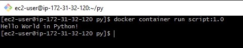

# Docker

### 1 - Execute o comando hostname em um container usando a imagem alpine. Certifique-se que o container será removido após a execução.

```bash
sudo docker container run alpine hostname
sudo docker container rm (hostname/id)
```

### 2 - Crie um container com a imagem nginx (versão 1.22), expondo a porta 80 do container para a porta 8080 do host.
 O dockerfile referente a essa questão está abaixo desse repositório e os comandos utilizados pra rodar foram:
```bash
docker image build -t mynginx:1.0.0 .
docker container run -d -p 8080:80 mynginx:1.0.0
```

```dockerfile
FROM debian

RUN apt-get update && apt-get install nginx -y && apt-get clean

LABEL description="Web server"

VOLUME [ "/var/www/html/" ]

EXPOSE 80

CMD ["nginx", "-g", "daemon off;"]
```

### 3 - Faça o mesmo que a questão anterior (2), mas utilizando a porta 90 no container. O arquivo de configuração do nginx deve existir no host e ser read-only no container.
 O dockerfile e o arquivo .conf referentes a essa questão estão em /questao_3 desse repositório.
 Eu tinha pensado tanto em dar um RUN chmod 0400 no Dockerfile quanto criar um volume read-only com o arquivo .conf.
 Resolvi manter a segunda resolução e os comandos utilizados pra rodar foram:
```bash
docker image build -t mine:1.0 .
docker container run -d -p 8088:90 --mount type=bind,src=$(pwd)/templ,dst=/etc/nginx/conf.d/,ro mine:1.0
```

### 4 - Construa uma imagem para executar o programa abaixo:
O dockerfile e o arquivo .py referentes a essa questão estão em /questao_2 desse repositório, o dockerfile também está abaixo, e os comandos utilizados pra rodar foram:
```bash
docker image build -t myscript:1.0 .
docker container run myscript:1.0
```
```dockerfile
FROM python:3

ENV BASE_DIR="/usr/src/app/"
WORKDIR ${BASE_DIR}

COPY ./main.py ${BASE_DIR}

CMD [ "python", "./main.py" ]
```


### 5 - Execute um container da imagem nginx com limite de memória 128MB e 1/2 CPU.
```bash
docker container run -d -m 128M --cpus 0.5 -p 8081:80 nginx
curl localhost:8081
```

### 6 - Qual o comando usado para limpar recursos como imagens, containers parados, cache de build e networks não utilizadas?
```bash
docker image build --no-cache -t [image]
```
### 7 - Como você faria para extrair os comandos Dockerfile de uma imagem?

```bash
docker pull chenzj/dfimage

alias dfimage="docker run -v /var/run/docker.sock:/var/run/docker.sock --rm chenzj/dfimage"

dfimage [image_id]
```
ou
```bash
docker history --no-trunc [image_id]
```